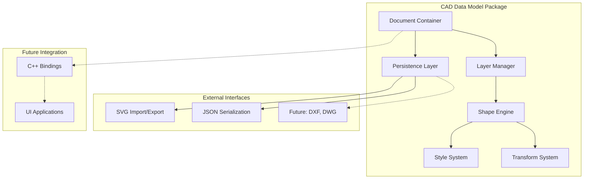
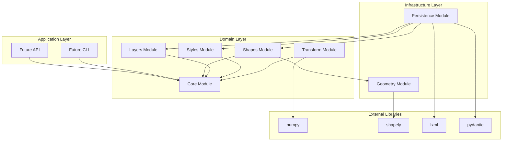
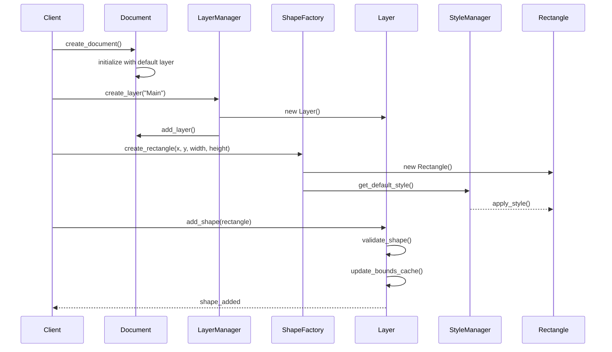
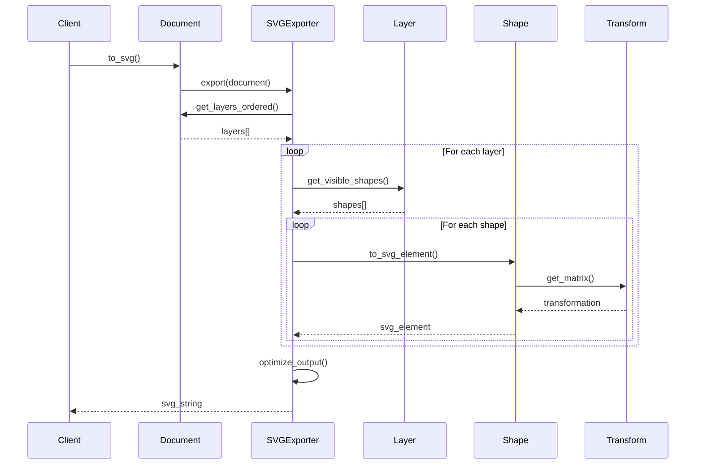
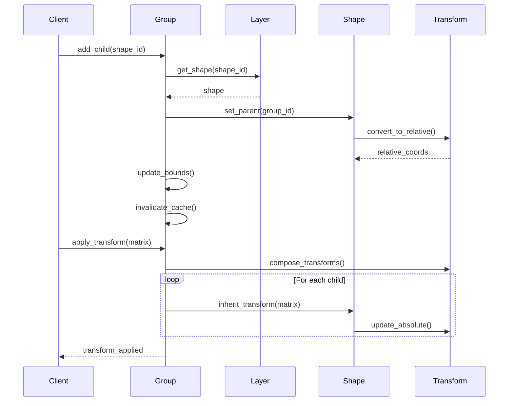

# CAD Drawing Application Architecture Document

## 1. Introduction

This document outlines the overall project architecture for CAD Drawing Application, including backend systems, shared services, and non-UI specific concerns. Its primary goal is to serve as the guiding architectural blueprint for AI-driven development, ensuring consistency and adherence to chosen patterns and technologies.

**Relationship to Frontend Architecture:**
If the project includes a significant user interface, a separate Frontend Architecture Document will detail the frontend-specific design and MUST be used in conjunction with this document. Core technology stack choices documented herein (see "Tech Stack") are definitive for the entire project, including any frontend components.

### 1.1 Starter Template or Existing Project

N/A - This is a greenfield Python package project built from scratch.

### 1.2 Change Log

| Date | Version | Description | Author |
|------|---------|-------------|--------|
| 2025-07-31 | 1.0 | Initial architecture document | Winston (AI Architect) |

## 2. High Level Architecture

### 2.1 Technical Summary

The CAD Drawing Application is designed as a pure Python data model library that provides comprehensive support for CAD drawing primitives, layer management, styling, and SVG import/export. The architecture follows object-oriented principles with a focus on extensibility, type safety, and performance optimization for large drawings (100,000+ shapes). The library serves as the foundation for future C++ optimization via direct Python bindings (using pybind11 or similar) while maintaining a clean Python API.

### 2.2 High Level Overview

1. **Architectural Style**: Object-oriented library with clear separation of concerns
2. **Repository Structure**: Single Python package repository (monolithic library)
3. **Service Architecture**: Library architecture with modular components
4. **Primary Data Flow**: Document → Layers → Shapes → Styles → Rendering/Persistence
5. **Key Architectural Decisions**:
   - Pure Python implementation for Phase 1 (C++ optimization in Phase 2)
   - Immutable data structures where possible for thread safety
   - Lazy evaluation for performance with large datasets
   - Clean abstraction layers to support multiple rendering backends

### 2.3 High Level Project Diagram



### 2.4 Architectural and Design Patterns

- **Factory Pattern**: Shape creation with type-specific factories - *Rationale:* Enables extensible shape types and consistent instantiation
- **Composite Pattern**: Groups containing shapes and nested groups - *Rationale:* Natural representation of hierarchical CAD structures
- **Strategy Pattern**: Different rendering strategies for various output formats - *Rationale:* Supports multiple export formats without modifying core models
- **Observer Pattern**: Change notification for model updates - *Rationale:* Enables reactive updates and undo/redo functionality
- **Repository Pattern**: Abstract data access for persistence - *Rationale:* Decouples storage implementation from business logic
- **Immutable Objects**: Core geometric properties are immutable - *Rationale:* Thread safety and predictable behavior
- **Lazy Evaluation**: Deferred computation of bounds and transforms - *Rationale:* Performance optimization for large drawings

## 3. Tech Stack

This is the DEFINITIVE technology selection for the entire project. All development must use these exact versions.

### 3.1 Cloud Infrastructure

- **Provider**: N/A (Local package initially)
- **Key Services**: PyPI for distribution
- **Deployment Regions**: Global via PyPI

### 3.2 Technology Stack Table

| Category | Technology | Version | Purpose | Rationale |
|----------|------------|---------|---------|-----------|
| **Language** | Python | 3.9+ | Primary development language | Wide compatibility, type hints support, good ecosystem |
| **Type Checking** | mypy | 1.11.0 | Static type checking | Catch errors early, improve code quality |
| **Testing** | pytest | 8.3.0 | Unit and integration testing | Industry standard, great plugin ecosystem |
| **Test Coverage** | pytest-cov | 5.0.0 | Code coverage reporting | Ensure comprehensive testing |
| **Linting** | Ruff | 0.5.0 | Fast Python linter and formatter | Modern, fast, replaces multiple tools |
| **Packaging** | setuptools | 70.0.0 | Package building | Standard Python packaging |
| **Build Backend** | hatchling | 1.25.0 | Modern build backend | PEP 517/518 compliant, simple configuration |
| **Documentation** | Sphinx | 7.4.0 | API documentation | Industry standard for Python docs |
| **Doc Theme** | sphinx-rtd-theme | 2.0.0 | Documentation theme | Clean, professional appearance |
| **Geometry Lib** | shapely | 2.0.5 | Geometric operations | Robust geometry algorithms |
| **SVG Parsing** | lxml | 5.3.0 | XML/SVG processing | Fast, feature-complete XML library |
| **Serialization** | pydantic | 2.8.0 | Data validation and serialization | Type safety, JSON schema generation |
| **Math Operations** | numpy | 1.26.0 | Numerical operations | Efficient array operations for transforms |
| **C++ Bindings** | pybind11 | 2.12.0 | Future C++ optimization | Direct Python-C++ bindings for performance |
| **Benchmarking** | pytest-benchmark | 4.0.0 | Performance testing | Track performance regressions |
| **CI/CD** | GitHub Actions | N/A | Continuous integration | Free for open source, good Python support |

## 4. Data Models

### 4.1 Shape

**Purpose:** Base class for all geometric shapes in the CAD system

**Key Attributes:**
- id: str - Unique identifier (UUID)
- type: ShapeType - Enumeration of shape type
- layer_id: str - Reference to containing layer
- group_id: Optional[str] - Reference to parent group
- visible: bool - Visibility flag
- locked: bool - Edit lock flag
- style: Style - Shape styling information
- transform: Transform - Transformation matrix
- metadata: Dict[str, Any] - Extensible metadata

**Relationships:**
- Belongs to exactly one Layer
- May belong to one Group (parent)
- Has one Style (owned or inherited)

### 4.2 Rectangle

**Purpose:** Rectangular shape with optional rounded corners

**Key Attributes:**
- x: float - Top-left X coordinate
- y: float - Top-left Y coordinate
- width: float - Rectangle width
- height: float - Rectangle height
- corner_radius: float - Optional corner rounding

**Relationships:**
- Inherits from Shape

### 4.3 Circle

**Purpose:** Circular shape

**Key Attributes:**
- cx: float - Center X coordinate
- cy: float - Center Y coordinate
- radius: float - Circle radius

**Relationships:**
- Inherits from Shape

### 4.4 Line

**Purpose:** Straight line segment

**Key Attributes:**
- x1: float - Start point X
- y1: float - Start point Y
- x2: float - End point X
- y2: float - End point Y

**Relationships:**
- Inherits from Shape

### 4.5 Polygon

**Purpose:** Closed or open polygon shape

**Key Attributes:**
- points: List[Point] - Ordered list of vertices
- closed: bool - Whether polygon is closed

**Relationships:**
- Inherits from Shape

### 4.6 Group

**Purpose:** Container for other shapes with hierarchical support

**Key Attributes:**
- children: List[str] - Ordered list of child shape IDs
- bounds_cache: Optional[Bounds] - Cached bounding box

**Relationships:**
- Inherits from Shape
- Contains 0..n Shapes (including other Groups)

### 4.7 Layer

**Purpose:** Organizational container for shapes with rendering order

**Key Attributes:**
- id: str - Unique identifier
- name: str - Human-readable name
- z_index: int - Rendering order (lower renders first)
- visible: bool - Layer visibility
- locked: bool - Layer edit lock
- opacity: float - Layer opacity (0.0-1.0)
- shapes: Set[str] - Set of shape IDs in this layer

**Relationships:**
- Contains 0..n Shapes
- Belongs to one Document

### 4.8 Style

**Purpose:** Visual styling properties for shapes

**Key Attributes:**
- fill_color: Optional[Color] - Fill color
- fill_opacity: float - Fill transparency
- stroke_color: Optional[Color] - Stroke color
- stroke_width: float - Stroke width
- stroke_opacity: float - Stroke transparency
- stroke_dash: Optional[List[float]] - Dash pattern
- line_cap: LineCap - Line end style
- line_join: LineJoin - Line join style

**Relationships:**
- Owned by Shapes
- Can be shared via style library

### 4.9 Document

**Purpose:** Root container for entire CAD drawing

**Key Attributes:**
- id: str - Document identifier
- version: str - Document version
- created_at: datetime - Creation timestamp
- modified_at: datetime - Last modification
- canvas_width: float - Canvas dimensions
- canvas_height: float - Canvas dimensions
- units: Units - Measurement units
- layers: Dict[str, Layer] - All layers
- shapes: Dict[str, Shape] - All shapes
- styles: Dict[str, Style] - Named style library

**Relationships:**
- Contains 1..n Layers
- Contains 0..n Shapes
- Contains 0..n Styles

## 5. Components

### 5.1 Core Module

**Responsibility:** Base classes and interfaces for all CAD entities

**Key Interfaces:**
- IShape: Shape interface
- IRenderer: Rendering interface
- ISerializer: Serialization interface

**Dependencies:** None (foundation module)

**Technology Stack:** Pure Python with ABC (Abstract Base Classes)

### 5.2 Shapes Module

**Responsibility:** Concrete shape implementations

**Key Interfaces:**
- ShapeFactory: Creates shapes by type
- BoundsCalculator: Computes bounding boxes
- ShapeValidator: Validates shape constraints

**Dependencies:** Core Module, Geometry Module

**Technology Stack:** Python with numpy for calculations

### 5.3 Layers Module

**Responsibility:** Layer management and shape organization

**Key Interfaces:**
- LayerManager: CRUD operations for layers
- LayerSorter: Z-order management
- ShapeAssigner: Shape-to-layer assignment

**Dependencies:** Core Module

**Technology Stack:** Pure Python with ordered collections

### 5.4 Styles Module

**Responsibility:** Visual styling and appearance management

**Key Interfaces:**
- StyleManager: Style CRUD and inheritance
- ColorParser: Color format conversion
- StyleValidator: Style constraint validation

**Dependencies:** Core Module

**Technology Stack:** Python with color library support

### 5.5 Transform Module

**Responsibility:** Geometric transformations and matrix operations

**Key Interfaces:**
- TransformBuilder: Fluent transform creation
- MatrixCalculator: Matrix math operations
- TransformComposer: Transform combination

**Dependencies:** Core Module, numpy

**Technology Stack:** Python with numpy for matrix operations

### 5.6 Persistence Module

**Responsibility:** Serialization and deserialization to various formats

**Key Interfaces:**
- DocumentSerializer: Document save/load
- SVGExporter: SVG export
- SVGImporter: SVG import
- JSONSerializer: JSON format support

**Dependencies:** All modules, lxml, pydantic

**Technology Stack:** Python with lxml for XML, pydantic for JSON

### 5.7 Geometry Module

**Responsibility:** Geometric calculations and spatial operations

**Key Interfaces:**
- SpatialIndex: Fast spatial queries
- GeometryCalculator: Intersection, union, etc.
- HitTester: Point-in-shape testing

**Dependencies:** Core Module, shapely

**Technology Stack:** Python with shapely for robust geometry

### Component Diagram



## 6. External APIs

This project does not require external API integrations in Phase 1. Future phases may integrate with:
- CAD file format APIs (DXF, DWG)
- Cloud storage APIs
- Rendering service APIs

## 7. Core Workflows

### 7.1 Document Creation and Shape Addition



### 7.2 SVG Export Workflow



### 7.3 Group Operations



## 8. Database Schema

This library does not use a database directly. However, for applications that persist CAD documents, here's the recommended schema:

### 8.1 Relational Database Schema (PostgreSQL)

```sql
-- Documents table
CREATE TABLE documents (
    id UUID PRIMARY KEY,
    version VARCHAR(10) NOT NULL,
    created_at TIMESTAMP NOT NULL,
    modified_at TIMESTAMP NOT NULL,
    canvas_width DECIMAL(10,2) NOT NULL,
    canvas_height DECIMAL(10,2) NOT NULL,
    units VARCHAR(10) NOT NULL,
    metadata JSONB
);

-- Layers table
CREATE TABLE layers (
    id UUID PRIMARY KEY,
    document_id UUID REFERENCES documents(id) ON DELETE CASCADE,
    name VARCHAR(255) NOT NULL,
    z_index INTEGER NOT NULL,
    visible BOOLEAN DEFAULT true,
    locked BOOLEAN DEFAULT false,
    opacity DECIMAL(3,2) DEFAULT 1.0,
    UNIQUE(document_id, z_index)
);

-- Shapes table (with inheritance)
CREATE TABLE shapes (
    id UUID PRIMARY KEY,
    type VARCHAR(50) NOT NULL,
    document_id UUID REFERENCES documents(id) ON DELETE CASCADE,
    layer_id UUID REFERENCES layers(id) ON DELETE CASCADE,
    group_id UUID REFERENCES shapes(id) ON DELETE SET NULL,
    visible BOOLEAN DEFAULT true,
    locked BOOLEAN DEFAULT false,
    transform_matrix DECIMAL[] DEFAULT ARRAY[1,0,0,1,0,0],
    style_id UUID REFERENCES styles(id),
    metadata JSONB,
    -- Shape-specific data in JSONB
    shape_data JSONB NOT NULL,
    -- Spatial index for performance
    bounds BOX NOT NULL,
    CONSTRAINT check_group_type CHECK (
        group_id IS NULL OR 
        EXISTS (SELECT 1 FROM shapes WHERE id = group_id AND type = 'group')
    )
);

-- Spatial index for efficient queries
CREATE INDEX idx_shapes_bounds ON shapes USING GIST (bounds);
CREATE INDEX idx_shapes_layer ON shapes(layer_id);
CREATE INDEX idx_shapes_group ON shapes(group_id);

-- Styles table
CREATE TABLE styles (
    id UUID PRIMARY KEY,
    document_id UUID REFERENCES documents(id) ON DELETE CASCADE,
    name VARCHAR(255),
    fill_color VARCHAR(7),
    fill_opacity DECIMAL(3,2),
    stroke_color VARCHAR(7),
    stroke_width DECIMAL(10,2),
    stroke_opacity DECIMAL(3,2),
    stroke_dash DECIMAL[],
    line_cap VARCHAR(10),
    line_join VARCHAR(10)
);
```

### 8.2 Document Store Schema (MongoDB)

```javascript
{
  "_id": "uuid",
  "version": "1.0",
  "created_at": ISODate(),
  "modified_at": ISODate(),
  "canvas": {
    "width": 1000,
    "height": 800,
    "units": "px"
  },
  "layers": [
    {
      "id": "uuid",
      "name": "Layer 1",
      "z_index": 0,
      "visible": true,
      "locked": false,
      "opacity": 1.0
    }
  ],
  "shapes": [
    {
      "id": "uuid",
      "type": "rectangle",
      "layer_id": "uuid",
      "group_id": null,
      "bounds": {
        "min_x": 10,
        "min_y": 10,
        "max_x": 110,
        "max_y": 60
      },
      "data": {
        "x": 10,
        "y": 10,
        "width": 100,
        "height": 50,
        "corner_radius": 5
      },
      "style": {
        "fill_color": "#ff0000",
        "stroke_color": "#000000",
        "stroke_width": 2
      },
      "transform": [1, 0, 0, 1, 0, 0]
    }
  ],
  "styles": {
    "style_id": {
      "name": "Default Style",
      "fill_color": "#ffffff",
      "stroke_color": "#000000"
    }
  }
}
```

## 9. Source Tree

```plaintext
cad-datamodel/
├── .github/
│   └── workflows/
│       ├── ci.yml              # CI pipeline
│       └── release.yml         # PyPI release automation
├── docs/
│   ├── _static/               # Sphinx static files
│   ├── _templates/            # Sphinx templates
│   ├── conf.py               # Sphinx configuration
│   ├── index.rst             # Documentation index
│   ├── api/                  # API documentation
│   ├── tutorials/            # Usage tutorials
│   └── architecture.md       # This document
├── src/
│   └── cad_datamodel/
│       ├── __init__.py       # Package exports
│       ├── core/
│       │   ├── __init__.py
│       │   ├── base.py       # Base classes and interfaces
│       │   ├── types.py      # Type definitions
│       │   ├── exceptions.py # Custom exceptions
│       │   └── constants.py  # Constants and enums
│       ├── shapes/
│       │   ├── __init__.py
│       │   ├── shape.py     # Base shape class
│       │   ├── rectangle.py # Rectangle implementation
│       │   ├── circle.py    # Circle implementation
│       │   ├── line.py      # Line implementation
│       │   ├── polygon.py   # Polygon implementation
│       │   ├── polyline.py  # Polyline implementation
│       │   ├── group.py     # Group implementation
│       │   └── factory.py   # Shape factory
│       ├── layers/
│       │   ├── __init__.py
│       │   ├── layer.py     # Layer class
│       │   └── manager.py   # Layer management
│       ├── styles/
│       │   ├── __init__.py
│       │   ├── style.py     # Style class
│       │   ├── color.py     # Color handling
│       │   └── manager.py   # Style management
│       ├── transform/
│       │   ├── __init__.py
│       │   ├── matrix.py    # Matrix operations
│       │   ├── transform.py # Transform class
│       │   └── builder.py   # Transform builder
│       ├── geometry/
│       │   ├── __init__.py
│       │   ├── bounds.py    # Bounding box
│       │   ├── spatial.py   # Spatial indexing
│       │   └── operations.py # Geometric operations
│       ├── persistence/
│       │   ├── __init__.py
│       │   ├── serializer.py # Base serializer
│       │   ├── svg.py       # SVG import/export
│       │   ├── json.py      # JSON serialization
│       │   └── validator.py # Data validation
│       └── document.py      # Document class
├── tests/
│   ├── __init__.py
│   ├── conftest.py          # Pytest configuration
│   ├── fixtures/            # Test fixtures
│   ├── unit/               # Unit tests
│   │   ├── test_shapes.py
│   │   ├── test_layers.py
│   │   ├── test_styles.py
│   │   ├── test_transform.py
│   │   └── test_document.py
│   ├── integration/        # Integration tests
│   │   ├── test_svg_io.py
│   │   ├── test_json_io.py
│   │   └── test_workflows.py
│   └── performance/        # Performance tests
│       └── test_large_drawings.py
├── examples/
│   ├── basic_usage.py      # Simple examples
│   ├── advanced_groups.py  # Group operations
│   ├── svg_import.py       # SVG import example
│   └── large_drawing.py    # Performance example
├── benchmarks/
│   └── shape_operations.py # Performance benchmarks
├── .gitignore
├── .gitattributes
├── LICENSE                 # MIT License
├── README.md              # Project README
├── CONTRIBUTING.md        # Contribution guidelines
├── CHANGELOG.md          # Version history
├── pyproject.toml        # Modern Python packaging
├── setup.py              # Legacy setup (for compatibility)
├── setup.cfg             # Setup configuration
├── requirements.txt      # Production dependencies
├── requirements-dev.txt  # Development dependencies
├── .pre-commit-config.yaml # Pre-commit hooks
├── mypy.ini              # Type checking config
├── ruff.toml             # Linter configuration
└── tox.ini               # Test automation
```

## 10. Infrastructure and Deployment

### 10.1 Infrastructure as Code

- **Tool:** GitHub Actions (for CI/CD)
- **Location:** `.github/workflows/`
- **Approach:** Automated testing and PyPI deployment

### 10.2 Deployment Strategy

- **Strategy:** Continuous Deployment to PyPI on tagged releases
- **CI/CD Platform:** GitHub Actions
- **Pipeline Configuration:** `.github/workflows/release.yml`

### 10.3 Environments

- **Development:** Local development with virtual environments - `pip install -e .`
- **Testing:** Automated testing in CI across Python 3.9, 3.10, 3.11, 3.12
- **Staging:** Test PyPI for pre-release validation - `test.pypi.org`
- **Production:** PyPI for public distribution - `pypi.org`

### 10.4 Environment Promotion Flow

```text
Local Development
    ↓ (git push)
Feature Branch CI
    ↓ (PR merge)
Main Branch CI
    ↓ (version tag)
Test PyPI Release
    ↓ (validation)
Production PyPI Release
```

### 10.5 Rollback Strategy

- **Primary Method:** Version pinning - users can downgrade via pip
- **Trigger Conditions:** Critical bugs, security issues, API breaking changes
- **Recovery Time Objective:** < 1 hour for PyPI yanking if needed

## 11. Error Handling Strategy

### 11.1 General Approach

- **Error Model:** Exception hierarchy with specific error types
- **Exception Hierarchy:** CADError → specific errors (ValidationError, GeometryError, etc.)
- **Error Propagation:** Fail fast with descriptive messages, no silent failures

### 11.2 Logging Standards

- **Library:** Python standard logging module
- **Format:** `%(asctime)s - %(name)s - %(levelname)s - %(message)s`
- **Levels:** DEBUG, INFO, WARNING, ERROR, CRITICAL
- **Required Context:**
  - Correlation ID: Not applicable for library
  - Service Context: Module and function name
  - User Context: No user tracking in library

### 11.3 Error Handling Patterns

#### External API Errors
- **Retry Policy:** Not applicable (no external APIs)
- **Circuit Breaker:** Not applicable
- **Timeout Configuration:** Not applicable
- **Error Translation:** Not applicable

#### Business Logic Errors
- **Custom Exceptions:** 
  - `ShapeValidationError`: Invalid shape parameters
  - `LayerError`: Layer operation failures
  - `TransformError`: Invalid transformations
  - `SerializationError`: Import/export failures
- **User-Facing Errors:** Clear messages with context
- **Error Codes:** String-based error codes for each exception type

#### Data Consistency
- **Transaction Strategy:** Atomic operations on document modifications
- **Compensation Logic:** Undo/redo support via command pattern
- **Idempotency:** All operations are idempotent

## 12. Coding Standards

### 12.1 Core Standards

- **Languages & Runtimes:** Python 3.9+ (support 3.9, 3.10, 3.11, 3.12)
- **Style & Linting:** Ruff with default configuration + format checking
- **Test Organization:** `tests/unit/test_<module>.py`, `tests/integration/test_<feature>.py`

### 12.2 Naming Conventions

| Element | Convention | Example |
|---------|-----------|---------|
| Classes | PascalCase | `Rectangle`, `LayerManager` |
| Functions | snake_case | `add_shape`, `calculate_bounds` |
| Constants | UPPER_SNAKE_CASE | `DEFAULT_STROKE_WIDTH` |
| Private | Leading underscore | `_internal_method` |
| Modules | snake_case | `shape_factory.py` |

### 12.3 Critical Rules

- **Type Annotations Required:** All public APIs must have complete type hints
- **No Mutable Defaults:** Never use mutable default arguments (use None + check)
- **Explicit Exports:** Use `__all__` in all `__init__.py` files
- **Import Order:** Standard library, third-party, local (enforced by Ruff)
- **Docstrings Required:** All public classes and functions need docstrings
- **No Print Statements:** Use logging module exclusively
- **Bounds Validation:** All coordinate inputs must be validated
- **Immutable Geometries:** Shape coordinates are read-only after creation

### 12.4 Python-Specific Guidelines

- **Properties Over Getters:** Use @property for simple accessors
- **Context Managers:** Use for resource management (file I/O)
- **Generators for Large Data:** Use generators for shape iteration in large drawings
- **Dataclasses/Pydantic:** Use Pydantic models for all data structures

## 13. Test Strategy and Standards

### 13.1 Testing Philosophy

- **Approach:** Test-first development where practical
- **Coverage Goals:** Minimum 90% code coverage, 100% for critical paths
- **Test Pyramid:** 70% unit, 20% integration, 10% performance

### 13.2 Test Types and Organization

#### Unit Tests
- **Framework:** pytest 8.3.0
- **File Convention:** `test_<module_name>.py`
- **Location:** `tests/unit/`
- **Mocking Library:** pytest built-in fixtures and unittest.mock
- **Coverage Requirement:** 95% per module

**AI Agent Requirements:**
- Generate tests for all public methods
- Cover edge cases and error conditions
- Follow AAA pattern (Arrange, Act, Assert)
- Mock all external dependencies

#### Integration Tests
- **Scope:** End-to-end workflows, file I/O, module interactions
- **Location:** `tests/integration/`
- **Test Infrastructure:**
  - **File System:** Temporary directories via pytest tmp_path
  - **Large Data:** Generated fixtures for performance testing

#### Performance Tests
- **Framework:** pytest-benchmark 4.0.0
- **Scope:** Shape operations, spatial indexing, large drawings
- **Environment:** Isolated benchmark suite
- **Test Data:** Procedurally generated drawings

### 13.3 Test Data Management

- **Strategy:** Fixtures and factories for test data generation
- **Fixtures:** `tests/fixtures/` for sample SVG files
- **Factories:** Builder pattern for complex test objects
- **Cleanup:** Automatic via pytest teardown

### 13.4 Continuous Testing

- **CI Integration:** Run on every push and PR
- **Performance Tests:** Nightly runs on main branch
- **Security Tests:** Dependency scanning via GitHub security

## 14. Security

### 14.1 Input Validation

- **Validation Library:** Pydantic for automatic validation
- **Validation Location:** At public API boundaries
- **Required Rules:**
  - All external inputs MUST be validated
  - Validation at API boundary before processing
  - Whitelist approach preferred over blacklist

### 14.2 Authentication & Authorization

- **Auth Method:** Not applicable (library has no auth)
- **Session Management:** Not applicable
- **Required Patterns:** Not applicable

### 14.3 Secrets Management

- **Development:** No secrets required
- **Production:** PyPI token via GitHub secrets
- **Code Requirements:**
  - NEVER hardcode secrets
  - Access via configuration service only
  - No secrets in logs or error messages

### 14.4 API Security

- **Rate Limiting:** Not applicable (library)
- **CORS Policy:** Not applicable
- **Security Headers:** Not applicable
- **HTTPS Enforcement:** Not applicable

### 14.5 Data Protection

- **Encryption at Rest:** User responsibility
- **Encryption in Transit:** Not applicable
- **PII Handling:** No PII collected or stored
- **Logging Restrictions:** No sensitive data logged

### 14.6 Dependency Security

- **Scanning Tool:** GitHub Dependabot
- **Update Policy:** Monthly updates for security patches
- **Approval Process:** PR review required for new dependencies

### 14.7 Security Testing

- **SAST Tool:** GitHub CodeQL
- **DAST Tool:** Not applicable
- **Penetration Testing:** Not applicable

## 15. Next Steps

### 15.1 Implementation Phase

1. Set up project structure and tooling
2. Implement core module with base classes
3. Add shape implementations
4. Build layer management
5. Create style system
6. Implement transform operations
7. Add persistence (SVG, JSON)
8. Write comprehensive tests
9. Create documentation
10. Set up CI/CD pipeline

### 15.2 Future Enhancements (Phase 2)

1. C++ optimization for performance-critical operations
2. Direct Python bindings using pybind11
3. Replace Python hot paths with C++ implementations:
   - Spatial indexing and hit testing
   - Matrix operations and transformations
   - Bounding box calculations
   - Large-scale shape operations
4. Additional file format support (DXF, DWG)
5. GPU acceleration for large drawings via CUDA/OpenCL
6. Memory-mapped file support for huge documents

### 15.3 Developer Onboarding

For AI agents implementing this architecture:
1. Start with the core module to establish interfaces
2. Follow TDD approach - write tests first
3. Use type hints throughout
4. Document all public APIs
5. Benchmark performance-critical sections
6. Follow the coding standards strictly