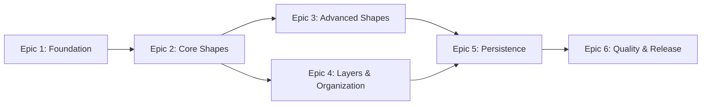

# CAD Drawing Application - Epic Definitions

## Overview

This document defines the development epics for the CAD Drawing Application data model library. Each epic represents a major deliverable that provides value and can be developed independently while building toward the complete system.

## Epic Progression

---

## Epic 1: Project Foundation & Core Infrastructure

**Goal:** Establish the project structure, development environment, and base classes that all other components will build upon.

**Value Delivered:** Development-ready project with CI/CD pipeline and foundational architecture.

### Key Deliverables:
- Complete project structure as defined in architecture
- Development environment setup (virtual env, tools)
- Core module with base classes and interfaces
- Basic exception hierarchy
- Type definitions and constants
- GitHub repository with CI pipeline
- Initial test infrastructure

### Acceptance Criteria:
- [ ] Project can be installed in development mode (`pip install -e .`)
- [ ] All development tools are configured (mypy, ruff, pytest)
- [ ] CI pipeline runs on push and PR
- [ ] Base Shape interface is defined with all required attributes
- [ ] Type checking passes with mypy
- [ ] Initial README with setup instructions

### Dependencies:
- User: GitHub account created
- User: Local Python 3.9+ environment

---

## Epic 2: Core Shape Implementation

**Goal:** Implement the fundamental shape types that form the basis of any CAD drawing.

**Value Delivered:** Working shape system with Rectangle, Circle, and Line - the minimum viable shapes for basic drawings.

### Key Deliverables:
- Rectangle shape with full implementation
- Circle shape with full implementation  
- Line shape with full implementation
- Shape factory for consistent creation
- Bounds calculation for all shapes
- Transform support (matrix operations)
- Comprehensive unit tests (>95% coverage)

### Acceptance Criteria:
- [ ] All shapes can be created with valid parameters
- [ ] Invalid parameters raise appropriate exceptions
- [ ] Bounds calculation works correctly for all shapes
- [ ] Shapes are immutable after creation
- [ ] Transform matrices can be applied
- [ ] Factory pattern creates shapes by type
- [ ] All shapes have complete type hints

### Dependencies:
- Epic 1 must be complete

---

## Epic 3: Advanced Shapes & Groups

**Goal:** Add complex shape types and hierarchical grouping capabilities.

**Value Delivered:** Full shape system supporting complex drawings with nested groups and polygons.

### Key Deliverables:
- Polygon shape implementation
- Polyline shape implementation
- Group container with hierarchy support
- Nested group capabilities
- Group transform inheritance
- Bounds calculation for groups
- Performance optimization for large groups

### Acceptance Criteria:
- [ ] Polygons support open and closed variants
- [ ] Groups can contain any shape including other groups
- [ ] Circular references are prevented
- [ ] Group transforms propagate to children
- [ ] Performance: 10,000 shapes in nested groups < 100ms operations
- [ ] Memory efficient for large hierarchies

### Dependencies:
- Epic 2 must be complete

---

## Epic 4: Layers & Style System

**Goal:** Implement layer management and comprehensive styling capabilities.

**Value Delivered:** Complete organizational system with layers and rich visual styling options.

### Key Deliverables:
- Layer class with z-ordering
- Layer manager for CRUD operations
- Style class with all properties
- Style inheritance system
- Color parsing and validation
- Default styles per shape type
- Layer-shape relationship management

### Acceptance Criteria:
- [ ] Layers maintain consistent z-order
- [ ] Shapes can only belong to one layer
- [ ] Layer deletion handles shape reassignment
- [ ] Styles support all defined properties
- [ ] Color formats: hex, RGB, RGBA, named
- [ ] Style inheritance works through groups
- [ ] At least one layer always exists

### Dependencies:
- Epic 2 must be complete

---

## Epic 5: Persistence & Serialization

**Goal:** Enable saving and loading of CAD documents in multiple formats.

**Value Delivered:** Full persistence layer with SVG import/export and JSON serialization.

### Key Deliverables:
- Document class as root container
- JSON serialization (pydantic models)
- SVG export functionality
- SVG import functionality
- Data validation on load
- Format optimization
- Document versioning support

### Acceptance Criteria:
- [ ] Documents can be saved to JSON and reloaded identically
- [ ] SVG export produces valid, optimized SVG
- [ ] SVG import handles common SVG elements
- [ ] No data loss in round-trip (save/load)
- [ ] Validation catches corrupt data
- [ ] Performance: 100k shapes serialize < 5 seconds
- [ ] File size optimization implemented

### Dependencies:
- Epic 3 and Epic 4 must be complete

---

## Epic 6: Quality Assurance & Release Preparation

**Goal:** Ensure production quality and prepare for PyPI release.

**Value Delivered:** Production-ready package available on PyPI with comprehensive documentation.

### Key Deliverables:
- Complete test suite (>90% coverage)
- Performance benchmarks
- API documentation (Sphinx)
- Usage examples
- Integration tests
- PyPI package configuration
- GitHub release automation

### Acceptance Criteria:
- [ ] All tests pass on Python 3.9, 3.10, 3.11, 3.12
- [ ] Documentation builds without warnings
- [ ] Examples run without errors
- [ ] Performance benchmarks establish baselines
- [ ] Package installs from Test PyPI successfully
- [ ] Security scanning passes (no vulnerabilities)
- [ ] LICENSE and CONTRIBUTING.md present

### Dependencies:
- Epic 5 must be complete
- User: PyPI account created

---

## Story Estimation

### Epic Sizes (Story Points):
- **Epic 1:** 13 points (Setup complexity)
- **Epic 2:** 21 points (Core functionality)  
- **Epic 3:** 21 points (Complex shapes)
- **Epic 4:** 13 points (Layers and styles)
- **Epic 5:** 34 points (Persistence complexity)
- **Epic 6:** 13 points (Quality and release)

**Total:** 115 story points

### Velocity Assumptions:
- AI Agent velocity: 8-13 points per session
- Estimated sessions: 10-15 sessions
- Each session includes implementation, testing, and code review

---

## Risk Mitigation

### Technical Risks:
1. **Performance with 100k+ shapes**
   - Mitigation: Implement spatial indexing early
   - Validate with benchmarks in each epic

2. **SVG compatibility**
   - Mitigation: Test with real-world SVG files
   - Focus on SVG subset used by CAD tools

3. **Memory usage with nested groups**
   - Mitigation: Lazy evaluation patterns
   - Cache invalidation strategy

### Process Risks:
1. **Scope creep**
   - Mitigation: Defer advanced features to Phase 2
   - Maintain focus on MVP data model

2. **API design changes**
   - Mitigation: Design review after Epic 1
   - Keep interfaces minimal and focused

---

## Success Metrics

- **Code Quality:** >90% test coverage, 0 mypy errors
- **Performance:** Handle 100k shapes efficiently
- **Adoption:** Successful PyPI publication
- **Documentation:** Complete API docs and examples
- **Compatibility:** Works on Python 3.9+